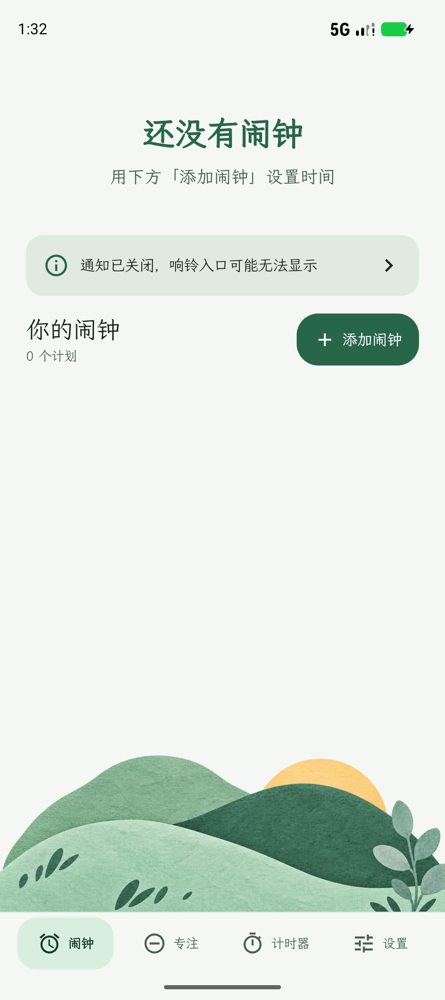
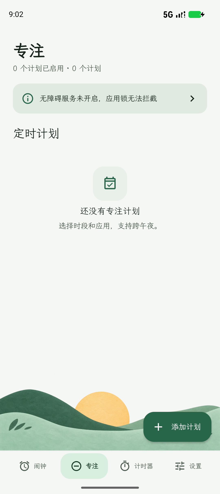
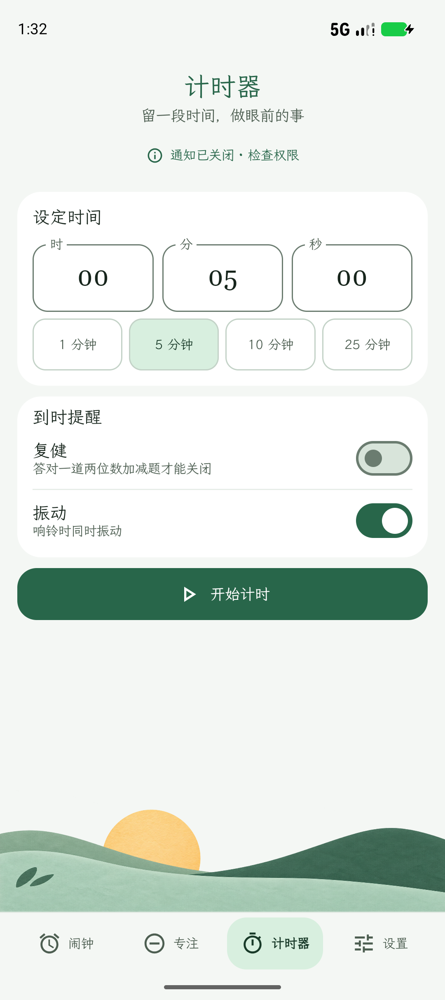
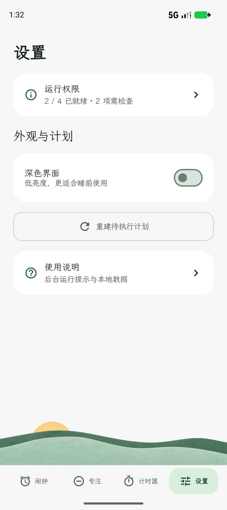

<p align="center">
  
</p>

# 朝醒（hs-robo-clock）

原生 Android 本地闹钟、计时器与定时应用锁，使用 Kotlin、Jetpack Compose 和 Material 3 构建，面向日常自用。

应用无需账号，没有云同步。规则与会话保存在设备本地，使用 Room、DataStore 和设备保护存储；当前 Manifest 未声明网络权限。

## 界面展示

以下为浅色主题界面示例，使用空白数据。

| 闹钟 | 专注 | 计时器 | 设置 |
| --- | --- | --- | --- |
|  |  |  |  |

## 核心功能

### 闹钟

- 支持一次性和按星期重复，提供标签、振动及独立的“复健”开关。
- 启用“复健”后，需要答对一道两位数加减题才能正常关闭响铃。
- 支持默认闹钟铃声、系统铃声和本地音频文件，提供试听；文件无法读取或解码时尝试备用铃声。
- 提供下一次闹钟倒计时，并在重启、时间或时区变化后恢复调度。
- 响铃使用沉浸日光全局蒙版；允许“显示在其他应用上层”后，可在使用其他应用时自动弹出。锁屏提醒可直接关闭或答题，无需先解锁手机。

### 计时器

- 同一时间运行一个计时器，时长范围为 1 秒至 24 小时。
- 提供 1 / 5 / 10 / 25 分钟快捷时长，支持暂停、继续和确认取消。
- 到时进入与闹钟相同的全局蒙版，可选振动和“复健”；已经响铃的复健会话需答题关闭。

### 定时应用锁

- 按星期和时间段限制多个应用，支持跨午夜；重复日期按时段开始日解释。
- 通过无障碍服务识别前台应用并显示拦截蒙版，重叠时段合并受限应用。
- 提供应急解除：等待 60 秒后再次确认，等待期间继续限制；未来时段仍按计划执行。

### 界面

- 闹钟、专注、计时器、设置四个页面，支持系统深浅色主题。
- 薄荷配色、山景过渡、霞鹜文楷中文与 Gelasio 时间数字。
- 针对窄窗口、大字体和横屏调整布局，设置页集中提供运行权限与使用说明入口。
- 响铃布局以深色背景和完整的不规则手绘太阳为主体，标题与次级时间左对齐。
- 响铃蒙版内置数字键盘，横屏使用双列布局；响铃时音量键控制闹钟音量。

## 运行要求与首次使用

设备要求：Android 10（API 29）或更高版本。

1. 在“设置 → 运行权限”中授予精确闹钟和通知权限，并检查“锁屏全屏提醒”状态。
2. 开启“响铃全局蒙版”，在系统页面允许朝醒“显示在其他应用上层”，使闹钟和计时器到时自动盖住当前应用。未授权时，使用其他应用期间会显示系统通知入口。
3. 使用应用锁时，手动开启“朝醒 · 定时应用锁”无障碍服务。侧载安装若出现“受限设置”，按系统提示允许受限设置后再开启服务。
4. 检查应用的后台运行与电池管理设置，避免被休眠或后台限制；不同设备的设置入口可能不同。
5. 在允许声音的环境创建短时闹钟与计时器，确认铃声、振动、全局蒙版、锁屏答题和关闭流程，再保存日常计划。

未授予精确闹钟权限时会显示未排程；恢复权限后可使用“重建待执行计划”。勿扰模式、闹钟音量、通知渠道与后台策略也会影响提醒效果。

全局蒙版与锁屏操作不需要 root；闹钟蒙版使用独立响铃页面，专注的无障碍服务只用于应用锁。关闭锁屏响铃不会解除手机的系统锁屏。

## 构建与安装

### 工具链

| 项目 | 当前配置 |
| --- | --- |
| Android Gradle Plugin / Gradle Wrapper | 9.3.1 / 9.5.0 |
| Kotlin / Compose 编译插件 | AGP 内置 Kotlin / 2.2.10 |
| Compose BOM / KSP | 2026.02.01 / 2.3.6 |
| compileSdk / targetSdk / minSdk | 37 / 37 / 29 |
| 开发使用的 JDK / 字节码目标 | JDK 25 / Java 17 |
| 应用包名 / 版本 | `dev.daybreak.clock` / `0.1.2` |

安装 Android SDK Platform 37，并将 `JAVA_HOME` 指向本机 JDK。Java 17 是字节码目标，不代表当前 AGP / Gradle 工具链可用 JDK 17 构建。首次构建需要联网下载依赖。

在项目根目录创建本机 `local.properties`，将以下示例替换为实际 SDK 路径；该文件不提交到仓库：

```properties
sdk.dir=C:/Android/Sdk
```

### 生成 APK

Windows（PowerShell）：

```powershell
.\gradlew.bat :app:assembleDebug
.\gradlew.bat :app:assembleRelease
```

macOS / Linux：

```bash
./gradlew :app:assembleDebug
./gradlew :app:assembleRelease
```

构建输出：

| 类型 | APK 路径 |
| --- | --- |
| Debug | `app/build/outputs/apk/debug/app-debug.apk` |
| Release | `app/build/outputs/apk/release/app-release.apk` |

Release 启用 R8 与资源收缩，当前使用本机 debug 密钥签名，适用于自用构建。正式发布前需要单独配置发布签名。

### 安装到设备

启用设备 USB 调试并确认电脑授权，将 SDK 的 `platform-tools` 加入 `PATH`，然后执行：

```bash
adb devices -l
adb install -r app/build/outputs/apk/debug/app-debug.apk
```

连接多个设备时，使用 `adb -s <设备序列号> install -r ...` 指定目标设备。

## 测试

在项目根目录运行；Windows 使用 `gradlew.bat`，macOS / Linux 使用 `./gradlew`：

```powershell
.\gradlew.bat :app:testDebugUnitTest :app:lintDebug
.\gradlew.bat :app:connectedDebugAndroidTest
```

本轮通过 44 项单元测试、debug / release 构建与 lint。单元测试覆盖共享执行核心、闹钟和专注状态转换、时间规则、计时器与服务状态；既有设备测试另有 19 个不同用例的分批运行及修复后复跑记录。`connectedDebugAndroidTest` 需要已连接的设备或模拟器。

最终 APK 已通过 v2 签名校验和 16 KB zipalign 检查，并成功覆盖安装到 Galaxy S25+。最终构建包含闹钟及计时器的蒙版权限提示。

新增响铃蒙版测试在 API 37 模拟器上 3 / 3 通过：闹钟覆盖前台系统设置并在关闭后返回；PIN 锁屏计时器答错继续响、答对关闭后仍锁定；禁用全局蒙版权限而保留全屏通知时，锁屏计时器仍自动打开并可关闭。Galaxy S25+（Android 16）另已实测密码锁屏下的 25 秒计时器自动亮屏显示蒙版，通过内置数字键盘答题关闭后，系统锁屏保持锁定。

关机重启后首次解锁前、Doze、长待机与其他厂商机型仍未完成本轮完整真机验证。

## 源码结构

主代码位于 `app/src/main/java/dev/daybreak/clock/`：

| 目录 | 职责 |
| --- | --- |
| `ui/`、`feature/` | Compose 界面、编辑流程与 ViewModel |
| `domain/` | 时间计算、跨午夜规则、算术题与应急等待 |
| `domain/execution/` | 共享执行核心、时间采样、命令串行与调度接口 |
| `domain/alarm/` | 闹钟和计时器状态转换、响铃输出控制器 |
| `domain/focus/` | 专注窗口、应急解除与输出控制器 |
| `data/` | Room 数据库、DataStore 偏好及设备保护执行日志 |
| `platform/execution/` | Android 时间与系统调度适配 |
| `platform/alarm/` | Android 响铃存储、通知、音频与恢复适配 |
| `platform/focus/` | 专注事务存储、应用筛选、窗口包名与无障碍覆盖适配 |
| `app/src/test/`、`app/src/androidTest/` | 单元测试与设备测试 |

闹钟与专注共用执行核心、时间采样、系统调度和恢复入口，业务状态各自持久化。

## 现有限制

- 当前没有贪睡功能。算术题约束应用内的正常关闭流程，无法阻止关机、系统终止或调低音量。
- 应用锁依赖无障碍服务，强停、卸载、撤销权限、修改系统时间及系统后台限制均可能影响运行；分屏、弹窗和画中画尚未完整验证。
- 应用锁依赖解锁后的数据，暂不支持设备重启后首次解锁前的拦截。
- 闹钟提供 Direct Boot 恢复路径，但首次解锁前响铃、Doze 与长待机行为尚未完成完整真机验证。
- 当前启用 16 KB 页大小兼容模式；不能视为全部原生库均已满足 16 KB 对齐或已完成真机兼容验证。

## 字体许可

内置字体使用 SIL Open Font License 1.1，许可文本随项目保留：[Gelasio](app/src/main/assets/fonts/Gelasio-OFL.txt)、[霞鹜文楷 GB Lite](app/src/main/assets/fonts/LXGWWenKaiGBLite-OFL.txt)。字体许可仅适用于对应字体；项目尚未提供独立的代码许可证。
